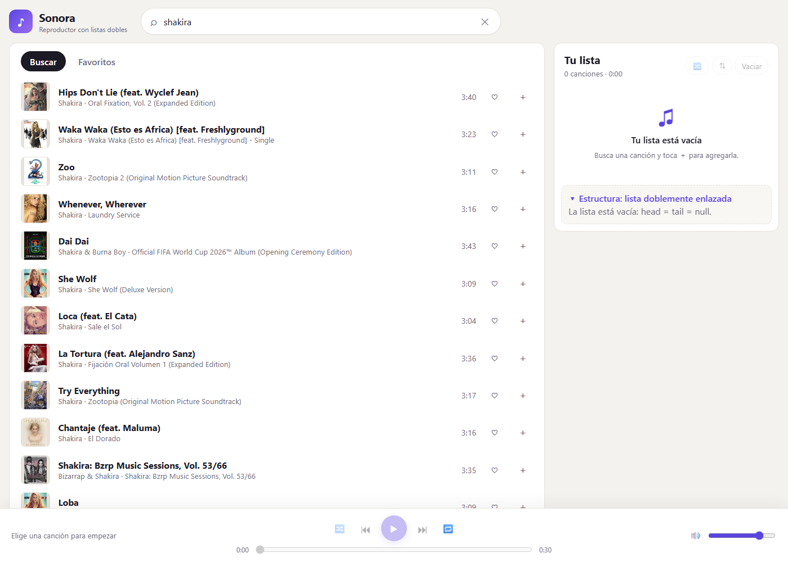

# Sonora · Reproductor de música con listas dobles

Taller de **listas doblemente enlazadas** en **TypeScript**. Sonora es un reproductor de música
web: buscas canciones reales, armas tu lista y la reproduces. Toda la lista de reproducción
está construida sobre una lista doble hecha a mano.



## Requerimientos del taller

| Requerimiento | Cómo se usa en la app | Código |
| --- | --- | --- |
| Frontend para interactuar | Toda la app (React + Vite) | `src/App.tsx`, `src/components/` |
| Agregar canción al **inicio** | ＋ → *Agregar al inicio* | `DoublyLinkedList.addFirst` |
| Agregar canción al **final** | ＋ → *Agregar al final* | `DoublyLinkedList.addLast` |
| Agregar en **cualquier posición** | ＋ → *En la posición [n]* | `DoublyLinkedList.insertAt` |
| **Eliminar** una canción | ✕ en *Tu lista* | `DoublyLinkedList.removeNode` |
| **Adelantar** canción | ⏭ (o Shift + →) | `Playlist.next` → puntero `next` |
| **Retroceder** canción | ⏮ (o Shift + ←) | `Playlist.previous` → puntero `prev` |

### Otras funcionalidades

- **Buscador de música real** (API pública de iTunes): canciones, artistas y álbumes con portada. Cada canción suena con su vista previa de 30 segundos.
- **Reproducir ahora** y **Reproducir a continuación** (inserta justo después del nodo actual).
- **Play / pausa**, barra de progreso, volumen y paso automático a la siguiente canción.
- **Repetir**: desactivado, toda la lista (recorrido circular: del `tail` vuelve al `head` y viceversa) o una canción.
- **Revolver** (Fisher-Yates reenlazando los mismos nodos), **invertir** (intercambiando `prev` y `next`), **mover** ↑↓ y **vaciar**.
- **Favoritos** ♥.
- La lista, los favoritos y el volumen **se guardan** en el navegador.
- **Diagrama de la lista doble**: cada nodo con sus punteros `prev` y `next`, `HEAD`, `TAIL`, la canción `ACTUAL` y el recorrido en ambos sentidos.
- Atajos de teclado (espacio, Shift + ← / →), controles multimedia del sistema y diseño adaptable al celular.

## La lista doble

```
null <- [Waka Waka] <-> [Loca] <-> [Chantaje] -> null
          head                       tail
```

- `src/lib/DoublyLinkedList.ts`: lista doble genérica. `ListNode<T>` tiene `value`, `prev` y `next`;
  la lista guarda `head`, `tail` y `size`. No usa arrays para guardar los datos.
- `src/lib/Playlist.ts`: la lista de reproducción, una `DoublyLinkedList<Song>` más un puntero
  `current` al nodo que está sonando.

| Operación | Complejidad |
| --- | --- |
| Agregar al inicio / final | O(1) |
| Insertar en posición | O(n), recorre desde el extremo más cercano |
| Eliminar un nodo | O(1) |
| Adelantar / retroceder | O(1) |

## Ejecutarlo en tu PC

Requiere Node.js 22 o superior.

```bash
npm install
npm run dev      # http://localhost:5173
npm test         # pruebas de la lista doble
npm run build    # versión de producción en dist/
```

## Desplegar en Vercel

1. Entra a https://vercel.com con tu cuenta de GitHub.
2. **Add New → Project** y elige este repositorio.
3. Vercel detecta **Vite** solo (build `npm run build`, carpeta `dist`). Dale a **Deploy**.

No necesita variables de entorno ni claves.
